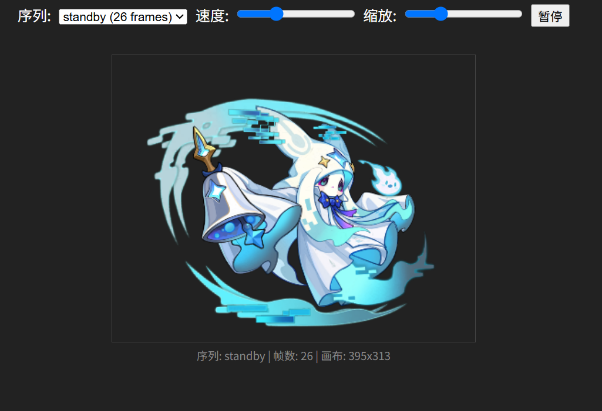

# Seer Unity Mesh Animation Extractor

提取 Unity 2D Mesh 动画序列，支持导出为 GIF / WebP / 逐帧 PNG，并提供 WebGL 浏览器预览。


## WebGL 浏览器预览

直接用浏览器打开 `index.html`，默认加载 `4913.pet.json` 和 `4913._Atlas_.png`。

支持功能：切换动画序列、调节播放速度、缩放、暂停/播放。



## 环境要求

- Python 3.8+
- Pillow

```bash
pip install Pillow
```

## 命令行用法

### 基础用法（导出 GIF）

```bash
python index.py 4913.pet.json 4913._Atlas_.png
```

### 导出逐帧 PNG

```bash
python index.py 4913.pet.json 4913._Atlas_.png --png
```

### 导出 WebP 动态图

```bash
python index.py 4913.pet.json 4913._Atlas_.png --webp
```

### 透明背景

```bash
python index.py 4913.pet.json 4913._Atlas_.png --transparent --webp
```

### 提取其他动画序列

```bash
python index.py 4913.pet.json 4913._Atlas_.png -s attack --webp --transparent
```

### 固定画布尺寸

```bash
python index.py 4913.pet.json 4913._Atlas_.png --width 800 --height 800
```

### 调整缩放与留白

```bash
# 增大 scale 让精灵在画布中更大
python index.py 4913.pet.json 4913._Atlas_.png --scale 200

# 自适应画布留白
python index.py 4913.pet.json 4913._Atlas_.png --padding 40
```

### 指定输出目录

```bash
python index.py 4913.pet.json 4913._Atlas_.png -o my_output
```

## 参数说明

| 参数               | 默认值    | 说明                    |
| ------------------ | --------- | ----------------------- |
| `asset`            | (必填)    | Unity 资产 JSON 文件    |
| `atlas`            | (必填)    | 图集纹理 PNG 文件       |
| `-o`, `--output`   | `output`  | 输出目录                |
| `-s`, `--sequence` | `standby` | 动画序列名称            |
| `--fps`            | `24`      | 帧率                    |
| `--scale`          | `120`     | 顶点缩放倍率            |
| `--width`          | 自适应    | 画布宽度                |
| `--height`         | 自适应    | 画布高度                |
| `--padding`        | `16`      | 自适应画布留白（像素）  |
| `--png`            | -         | 导出逐帧 PNG            |
| `--webp`           | -         | 导出 WebP 动态图        |
| `--webp-quality`   | `100`     | WebP 质量（100 = 无损） |
| `--transparent`    | -         | 使用透明背景            |
